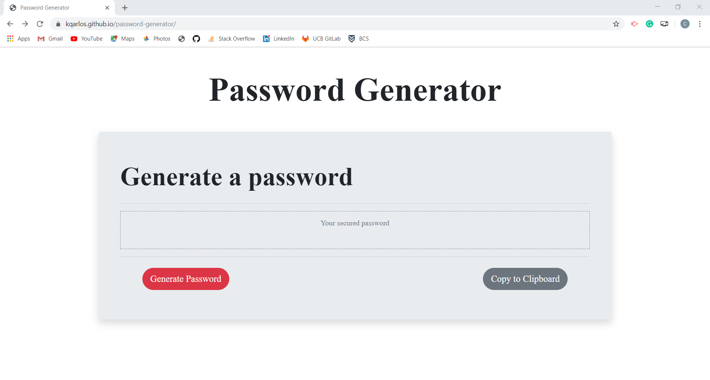

# Password Generator 🔑


</br>
<p align="center">
    
    
    
       
       
      
      
      
</p>


## Description

Passwords generator is a web application that generates a password between 8 and 128 characters based on certain requirements chosen by the user. It also has an option for copying the password to the clipboard.

## Table of Contents

* [Installation](#installation)
* [Usage](#usage)
* [Credits](#credits)
* [License](#license)

## Installation

This application is compatible with the most commonly used web browsers

<p align="center">
    <a href="https://kqarlos.github.io/password-generator/index.html"></a>
</p>

## Usage

### Screenshots



### Snippets

generatePassword();
* This function calls on checkRequirements() to set values to the requirements booleans. It will be false if the user cancels the prompt. Based on the requirements it pushes the desired characters into a pool choices. It generates the password by randomly chosing a character from the choices pool and addidng it to the password. This is reapeated according to the chosen length of the password. Then, the password is displayed and variables are cleared for future use.

```javascript

    function generatePassword() {
        let check = checkRequirements();
        if (check) {
            // Add to pool of char choices
            if (options.hasLowerCase) {
                choices += lowerCaseChars;
            } if (options.hasUpperCase) {
                choices += upperCaseChars;
            } if (options.hasNumericChars) {
                choices += numericChars;
            } if (options.hasSpecialChars) {
                choices += specialChars;
            }
            for (var i = 0; i < options.length; i++) {
                var char = choices[Math.floor(Math.random() * choices.length)];
                newPassword += char;
            }
            //display password
            passwordEl.innerHTML = newPassword;
            clear();
        }
    }
```

copyToClipboard();

* This shows the function copyToClipboard(). This function creates an input element genPassword wit the password value. This element then is used to select the password value and execute a copy command on it. This effectively copies the password to the clipboard. 

```javascript
    function copyToClipboard() {
        var genPass = document.createElement('input');
        document.body.appendChild(genPass);
        genPass.value = passwordPointer.innerText;
        genPass.select();
        genPass.setSelectionRange(0, 99999);
        document.execCommand("copy", false);
        genPass.remove();
        alert("Password copied to clipboard!");
    }
```

## Credits

### Author

- Carlos Toledo: [portfolio](https://kqarlos.github.io)
- Github: [kqarlos](https://www.github.com/kqarlos)
- LinkedIn: [carlos-toledo415](https://www.linkedin.com/in/carlos-toledo415/)

### Built With

<p align="center">
    <a href="https://developer.mozilla.org/en-US/docs/Web/HTML"></a>
    <a href="https://developer.mozilla.org/en-US/docs/Web/CSS"></a>
    <a href="https://www.javascript.com/"></a>
    <a href="https://getbootstrap.com/"></a>
</p>
</br>

## License

<p align="center">
    
</p>