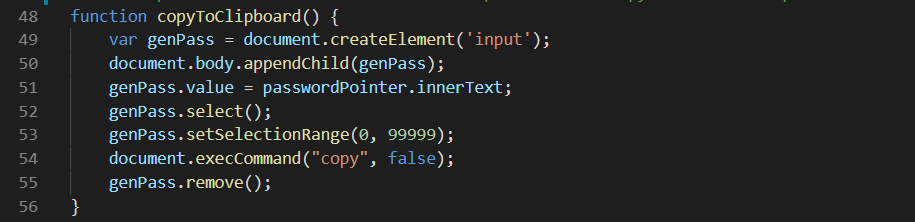
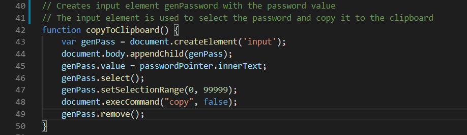

# Password Generator

Passwords generator is a web application that generates a password between 8 and 128 characters based on certain requirements chosen by the user. It also has an option for copying the password to the clipboard.

## Getting Started

This application is compatible with the most commonly used web browsers

## Site Picture

## Code Snippets

This shows the function generatePassword(). This function calls on checkRequirements() to set values to the requirements booleans. Based on the requirements it pushes the desired indices of the arrays we can use from the characters array into the choices array. It generates the password by randomly chosing an index from the choices array. This index is used in the characters array to pick a character array. Then a character is selected randomly from this array. This is reapeated according to the chosen length of the password. Then, the password is displayed and variables are cleared for future use.

This shows the function copyToClipboard(). This function crates an input element genPassword wit the password value. This element then is used to select the password value and execute a copy command on it. This effectively copies the password to the clipboard. 

## Built With

* [HTML](https://developer.mozilla.org/en-US/docs/Web/HTML)
* [CSS](https://developer.mozilla.org/en-US/docs/Web/CSS)
* [Bootstrap](https://getbootstrap.com/)

## Deployed Link

* [See Live Site](https://kqarlos.github.io/password-generator/index.html)

## Authors

* **Carlos Toledo** 

- [Link to Password Generator Site](https://github.com/kqarlos/password-generator)
- [Link to Github](https://www.github.com/kqarlos)
- [Link to LinkedIn](https://www.linkedin.com/in/carlos-toledo415/)

## Acknowledgments

* [W3 Schools](https://www.w3schools.com/)
* [Bootstrap components](https://getbootstrap.com/docs/4.4/components/navbar/)